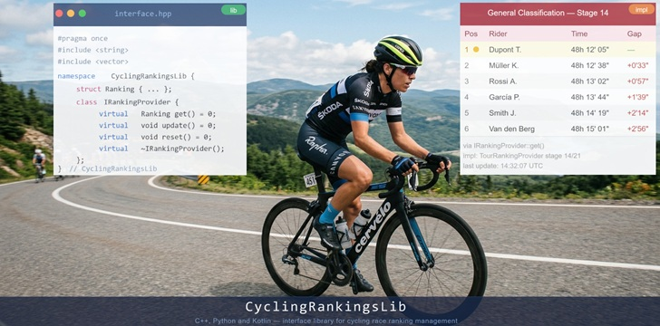

       

# CyclingRankingsLib
A generic library for the management of cycling races classifications / rankings

*Date of first publication:* 2026-08-30.  
*Date of last modification:* 2026-08-30.

## Currently no such library is available
A quick search on the Web revealed no such library coded in C++, Python or Kotlin. Don't know if such a library would be useful for the community, but it would fit the needs of a personnal project.

## Main goals
This library just manages rankings of cycling races: daily classifications, secondary classifications, general classifications; for road, track, mountain bike, cyclo-cross, etc. races.

## Developments
Features and related Issues are currently under writing progress.

The library coding will be done in C++, Python and Kotlin programming languages.

### Dev branches management
Branch `main` is exclusively used for delivering releases.

Branch `dev`, created from `main`, is used for all developments.

Every new release is developed under its own specific branch, created from `dev`.

New features for any release should be developed under a dedicated branch, then merged to the release branch once validated (via unit tests and maybe integration tests).

### Releases management
Releases are named `vX.Y` with `X` starting at 0 and `Y` starting at 0 - except for release v0 which starts with v0.1.

No merge is allowed in branch `main` from any branch other than `dev`.

No merge is allowed in branch `dev` unless a release branch has been fully validated.

### Unit tests
Unitary tests will be implemented with:
- Google Tests `gtest` for c++;
- PyTest for Python;
- kotlin.test for Kotlin.

### Development environments and languages standards
First devlopments will be done in c++ with Visual Studio 2026. CMake files will then be generated to use gcc and clang under Linux.  
Notice: c++20 will be the used standard at first (by Sep. 2026).

Python developments will be done under Visual Studio Code or under VS 2026 - still not specified.  
Notice: Python 3.15 will be the used standard at first (by Sep. 2026).

Kotlin developments will be done under Android Studio.  
Notice: Kotlin 2.4 will be the used standard at first (by Sep. 2026).  
